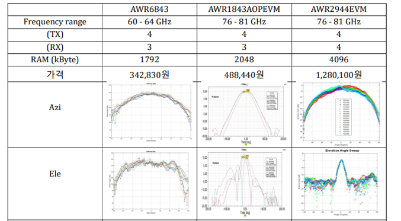

# ROS2 & Isaac Sim 기반 3D Perception 파이프라인 구축

본 프로젝트는 UNIST 하계 인턴십 과정 중 수행되었으며, NVIDIA Isaac Sim 환경에서 로봇의 자율 주행 및 맵핑을 위한 고밀도 포인트 클라우드 생성 및 3D Reconstruction 파이프라인 구현을 목표로 합니다.

## 프로젝트 개요
* 기간: 2024년 UNIST 하계 인턴십
* 주요 성과: 
    * mmWave 레이더 하드웨어 사양 분석 및 선정 검토
    * Isaac Sim 데이터를 활용한 RGB-D to Point Cloud 변환 노드(d2p) 구현을 통한 컴퓨터 비전 학습
    * NVIDIA nvblox[1]를 활용한 실시간 맵핑 프로세스 구축을 통해 라이더와 rgbd 카메라 데이터 이용 실습
[1]: https://github.com/nvidia-isaac/nvblox
---

## 주요 수행 내용

### 1. 하드웨어 스펙 분석 및 시스템 설계
실제 환경 구축을 고려하여 다양한 mmWave 레이더 센서 사양을 분석하고, 프로젝트 목적에 적합한 사양을 검토했습니다.
추후 해당 연구실에 사용될 레이더 구매 및 초기 세팅을 마저 진행했습니다.

| 분류 | AWR6843 | AWR1843AOPEVM | AWR2944EVM |
| :--- | :---: | :---: | :---: |
| Frequency Range | 60 - 64 GHz | 76 - 81 GHz | 76 - 81 GHz |
| Antenna (TX/RX) | 4 / 3 | 4 / 3 | 4 / 4 |
| RAM (kByte) | 1792 | 2048 | 4096 |

### 2. RGB-D to Point Cloud 변환 (d2p Node)
Isaac Sim에서 출력되는 2D Depth 이미지와 Odometry 데이터를 결합하여 실시간 3D 포인트 클라우드를 생성하는 ROS2 노드를 구현했습니다.

* Pinhole Camera Model: 이미지 평면의 픽셀 좌표를 3D 공간 좌표로 역투영합니다.
    * $x = \frac{(u - c_x) \cdot z}{f_x}$
    * $y = \frac{(v - c_y) \cdot z}{f_y}$
* Coordinate Transformation: Optical Frame과 ROS2 World Frame 간의 좌표 불일치를 해결하기 위해 4x4 Transformation Matrix를 산출하여 적용했습니다.
* System Architecture: /jetbot/depth 및 /jetbot/odometry 토픽을 구독하여 /pointcloud_msg를 발행합니다.

### 3. nvblox 기반 3D Reconstruction
NVIDIA의 nvblox 오픈소스 라이브러리를 활용하여 GPU 가속 기반의 빠른 공간 매핑 시스템을 구축했습니다.

* TSDF (Truncated Signed Distance Field): 공간의 점과 표면 사이의 거리를 계산하여 정밀한 3D Mesh를 생성합니다.
* ESDF (Euclidean Signed Distance Field): 가장 가까운 장애물로부터의 거리를 계산하여 실시간 경로 계획에 활용합니다.
* Process: 데이터 클리닝 → 데이터 분할 → 각 방향별 개별 처리 → 결과 통합 및 3D 맵 생성 순으로 진행됩니다.

---

## Tech Stack
* Languages: Python, C++
* Frameworks: ROS2 (Humble/Foxy), NVIDIA Isaac Sim
* Libraries: NumPy, nvblox, rclpy
* Environment: Linux (Ubuntu 22.04), NVIDIA GPU/CUDA

---

## Result Visualization
